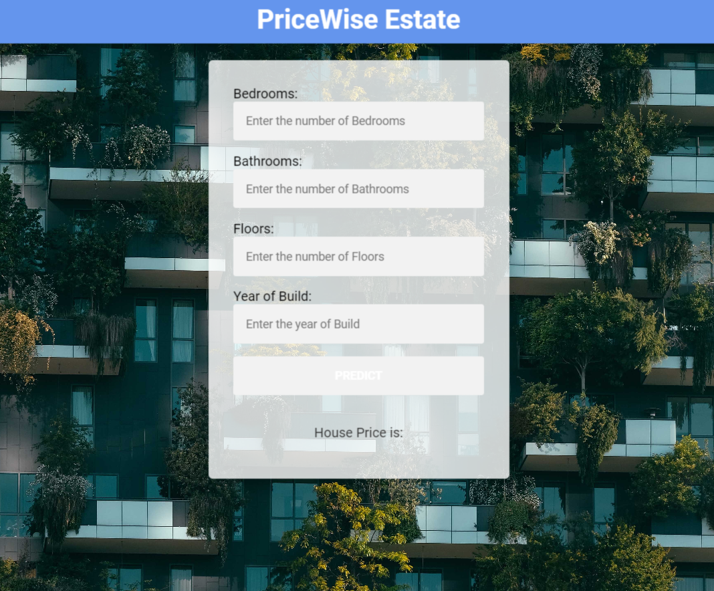
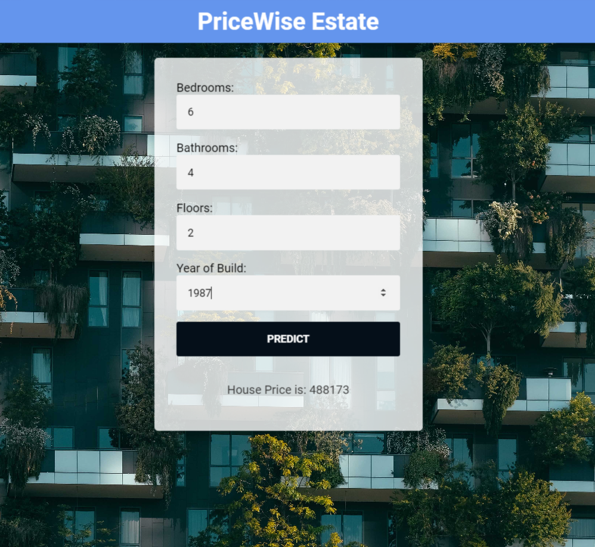

# PriceWise Estate 🏡💰

Welcome to PriceWise Estate, where predicting house sale prices becomes an art! This project harnesses the power of a well-trained model on housing data, brought to life through an elegant Flask API. Utilizing the magic of Linear Regression, our application empowers users to forecast house sale prices with confidence.

If you're eager for more insights, delve into the details on [House Sale Price Prediction]

## Installation 🚀

To set up the web app on your local machine, buckle up and install the required libraries. The necessary packages are neatly bundled in the `requirements.txt` file. Our project is like a well-chosen ensemble, starring Python 3.8.0 and Flask 2.0.1. Execute the following command in your terminal to summon the required packages:

```bash
pip install -r requirements.txt
Getting Started 🏁
Ready to witness the magic firsthand? Fire up the code on your machine using this command:

bash
Copy code
python app.py
Behold as PriceWise Estate comes to life, paving the way for you to explore and interact with the enchanting house sale price prediction model.

Feel free to embark on your own adventure, tweaking and enhancing the code to suit your unique vision. Have questions or want to share your insights? Reach out—we're all ears!
How it Works 🌟
Here are a couple of snapshots showcasing how PriceWise Estate works:

*Caption: Insert a deatils of property in the form.*


*Caption: click on predict button for prediction .*


Thank you for choosing PriceWise Estate! 🌟